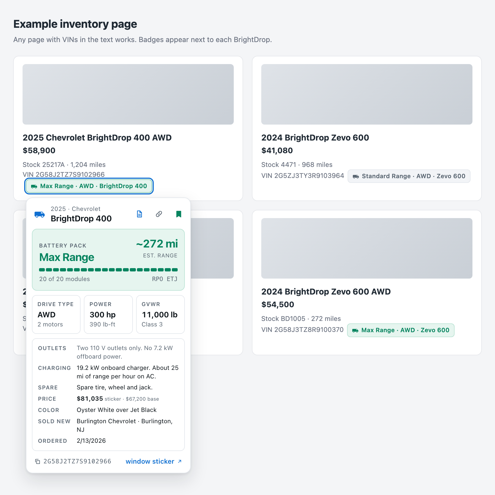
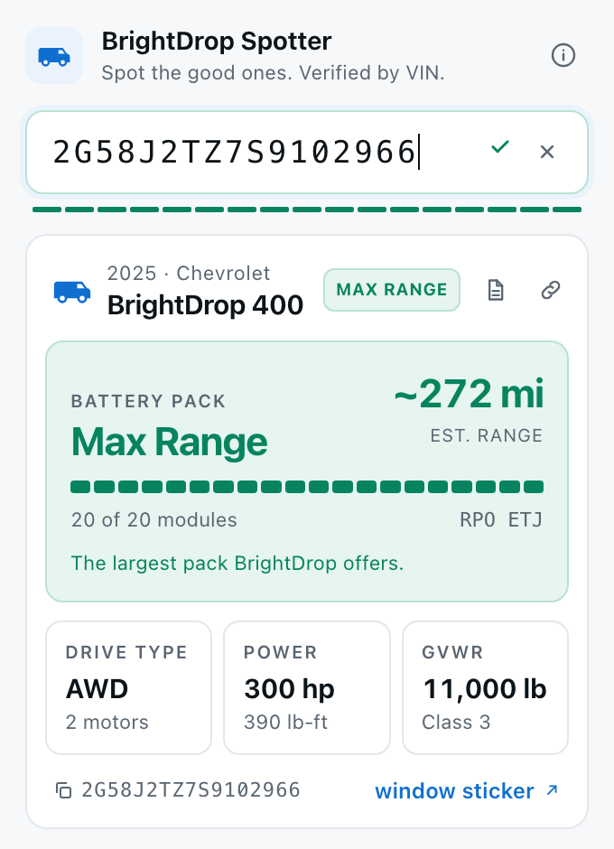
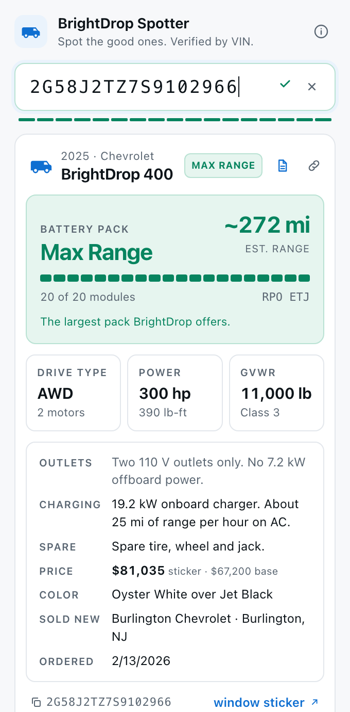
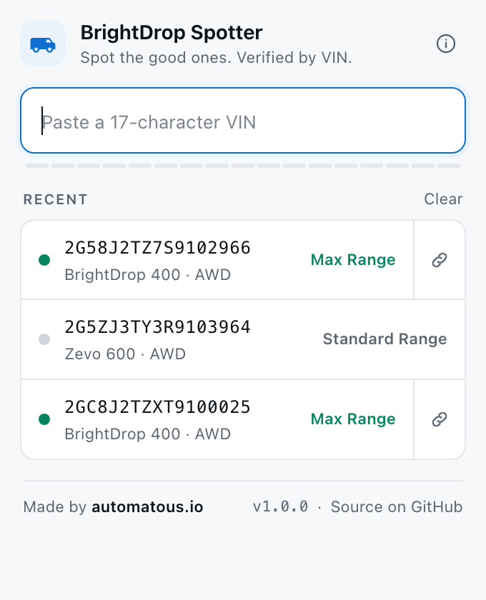

<!--
Copyright 2026 AUTOMATOUS.IO

Licensed under the Apache License, Version 2.0 (the "License");
you may not use this file except in compliance with the License.
You may obtain a copy of the License at

    http://www.apache.org/licenses/LICENSE-2.0

Unless required by applicable law or agreed to in writing, software
distributed under the License is distributed on an "AS IS" BASIS,
WITHOUT WARRANTIES OR CONDITIONS OF ANY KIND, either express or implied.
See the License for the specific language governing permissions and
limitations under the License.
-->

# BrightDrop Spotter

Spot the good ones. Verified by VIN.

A Chrome extension for anyone shopping for a BrightDrop 400 or 600 electric van. It badges every
BrightDrop VIN on the page you're reading with the battery pack, drive and model, and on hover shows
the full build: range, power, weight rating, and on request the window sticker's options and price.

Made by [automatous.io](https://github.com/automatous-io). Not affiliated with General Motors or
BrightDrop.



## Why

Standard Range and Max Range are about a hundred miles apart, and from 2026 there's an Extended
Range pack in between. Listings almost never say which one is fitted, and GM's inventory search
can't filter on it. The answer is in the VIN, filed with NHTSA by GM. This reads it for you.

## What you get

- **Badges beside every BrightDrop VIN** as you browse. Green is Max Range, amber is Extended
  Range, grey is Standard. Everything else on the page is left alone.
- **A hover card** with the pack, GM-estimated range for that model year and drive, module count,
  drive type, power, GVWR, and a copy button for the VIN.
- **Window sticker details on request.** One click reads GM's original build sheet for that van:
  7.2 kW offboard power outlets or their absence, onboard charger size, spare, speed governor,
  sticker price, colours and the dealer it was sold through.
- **A bookmark** on each card that saves the van to the popup's Recent list, along with the listing
  page it was found on. Click again to remove it. A link icon on the card, in the popup and in the
  Recent list opens that listing, so a van seen on one dealer site is a click away from another.
- **A popup** for checking a VIN by hand, laid out the same way as the card, with your recent and
  saved vans one click away. The × in the field, or Escape, takes you back to the list.

| Popup | Sticker details | Recent |
|---|---|---|
|  |  |  |

## Install

Not yet in the Chrome Web Store. To load it unpacked:

1. Download or clone this repository.
2. Open `chrome://extensions` and turn on **Developer mode** (top right).
3. Click **Load unpacked** and choose the repository folder, the one containing `manifest.json`.

Edge, Brave and other Chromium browsers work the same way. Firefox has not been tested.

There is nothing to configure. Badges appear on any http or https page except Google and Facebook,
which are excluded to keep the extension quiet where VINs never appear. The popup's info button
explains how the VIN is read and where every number comes from.

## Privacy

- VINs found on a page are sent to NHTSA's public vPIC database. No other service sees them.
- One VIN goes to GM's window sticker service only when you click for that van's sticker details.
- Bookmarking a van stores the address and title of the page you were on, so the popup can take
  you back to the listing. That stays on your device with the rest of the saved list.
- Results are cached on your device for 30 days. There are no accounts, no analytics and no
  telemetry.

## How it works, briefly

NHTSA's vPIC API returns GM's build record for each VIN: series, drive type, motor code and the
battery option code. `ETC` is Standard Range, `EWU` is Extended Range (2026 on), `ETJ` is Max Range.
Range figures are GM-estimated combined range for the van's model year and drive, taken from GM's
order guides. A positional decode of VIN positions 4 to 8 runs offline as a cross-check.

The window sticker is a text PDF that ends with a list of every option code on the build.
`sticker.js` decompresses it in the browser, reads that list and the price lines, and maps the
relevant codes (KV7, K2O, PCP, ZHR, KYW, KYR, KGU, RY9) to the descriptions in GM's order guides.
Stickers are fetched one at a time and only when asked.

| Position | Meaning | Values |
|---|---|---|
| 1-3 | Manufacturer | `2G5` through 2025, `2GC` from 2026 (shared with Chevrolet trucks; NHTSA confirms the model) |
| 4 | GVWR | `8` = 11,000 lb, `Z` = 9,990 lb |
| 6 | Model | `2` = 400, `3` = 600 |
| 8 | Powertrain | `6` FWD Standard, `Y` AWD Standard, `Z` AWD Max Range |
| 9 | Check digit | rejects anything that isn't a VIN |
| 10 | Model year | `R` 2024, `S` 2025, `T` 2026 |

## Development

```
manifest.json     MV3 manifest
vin.js            VIN decoder and range tables (ES module, no dependencies)
sticker.js        window sticker PDF reader and option legend
background.js     service worker: the only file that touches the network
content.js        content script: badges and the hover card
content.css       badge styles
popup.html/js     the toolbar popup
scripts/          tests and the icon builder
docs/             screenshots and store assets
```

Run the tests with `npm test`. Regenerate the icons with `npm run icons` after `npm i -D sharp`.

Range and weight figures come from GM's 2025 and 2026 order guides and GM's published 2024 figures.
Verify anything that matters against the window sticker and a pre-purchase inspection.

## Credits

Van glyph is `van-utility` from [Material Design Icons](https://pictogrammers.com/library/mdi/)
by Pictogrammers, Apache-2.0.

## License

Copyright 2026 [Automatous](https://github.com/automatous-io). Apache License 2.0. See [LICENSE](LICENSE)
and [NOTICE](NOTICE).
